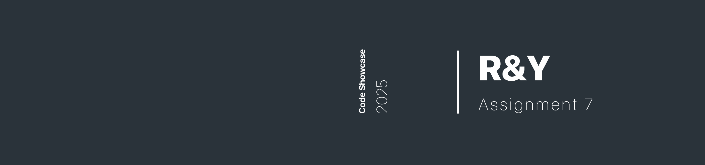
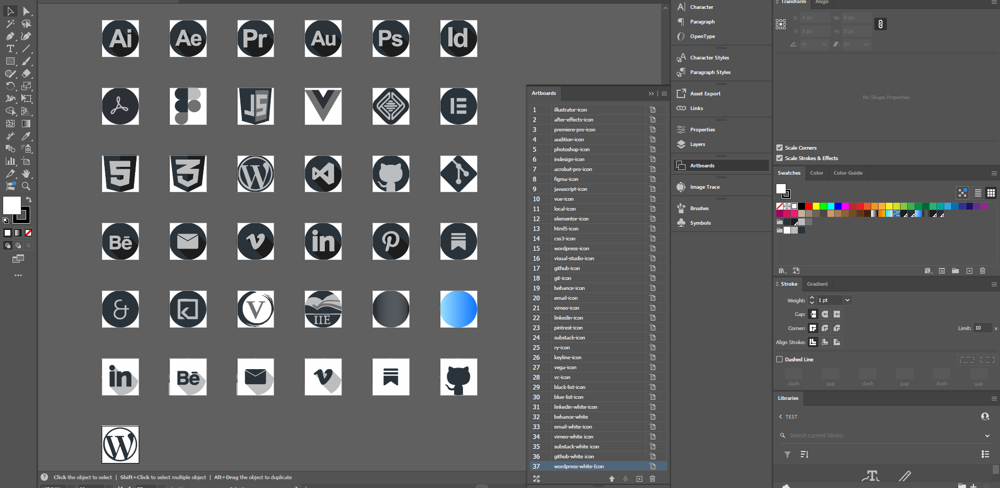
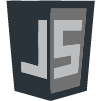

# Usage Notes   

All personal details below are placeholders and should be replaced with your own.  

---

# Project Description: Portfolio Website  

A clean and minimal portfolio website showcasing **front-end web development** and **multimedia design** skills.  
Built as a digital CV and portfolio, it highlights both **technical development** and **creative design** work.  

The site is fully responsive and developed with **semantic HTML5**, **CSS3**, **JavaScript**, and **Vue.js**.  

## Pages  

- **Welcome Page** – Overview of skills, toolkits and education.
- **Projects Page** – One example projects with an embedded motion reel and project description. 
- **Contact Page** – Professional presence with portfolio links, and contact form.

---

## Tech Stack

- **Languages**: HTML5, CSS3, JavaScript  
- **Frameworks**: Vue.js (for interactivity)  
- **Tools & Platforms**:  
  - Git & GitHub  
  - Visual Studio Code   
  - Figma  
  - Adobe Illustrator

---

## Design Choices

- **Typography**: Open Sans (light, regular, medium, semi-bold, bold, with italic variants).  
- **Layout**: Mobile-first responsive design using grids (`.columns-1,`, `.columns-2,`, `.columns-3`, `columns-4`).  
- **Brand Style**: Minimalist, with a focus on **Oxford Blue** (`#2a333a`) and **Milk White** (`#fefefe`). 
- **Consistency**: The brand colours are applied across online platforms for cohesive identity (github, behance, vimeo, substack).  

---

## Custom Icons  

The project includes **custom-designed icons** created to match the minimalist brand style.  
These icons ensure visual consistency across list bullets, social links, and project displays, reinforcing a unique portfolio identity. 

- **Icon Size**: Hierarchy by role: 

    - **18px** list bullets     
            

    - **18px** list bullets     
             

    - **24px** social links     
             

    - **45px** toolkit logos   
            

    - **55px** project icons    
            

---

## Colour Style Guide

The extended palette ensures flexibility for both **UI elements** and **multimedia design assets**.

### Colour Palette

| Role                        | Hex / CSS Value                                                          |
|-----------------------------|--------------------------------------------------------------------------|
| Main                        | `#2a333a` (Oxford Blue)                                                  |
| White Base                  | `#fefefe` (Milk White)                                                   |
| Main Accent                 | `#1075ff` (Bright Blue)                                                  |
| Secondary Accent            | `#ff9a10` (Vivid Orange)                                                 |
| Main Accent Analogous       | `#1076ff`, `#10c5ff`, `#10a5ff`, `#1075ff`, `#1045ff`, `#1015ff`         |
| Secondary Accent Analogous  | `#ff9a10`, `#ffb310`, `#ffd210`, `#ffa510`, `#ff8510`, `#ff6510`         |
| Black Gradient              | `linear-gradient(#30343a, #333132)`                                    |
| Blue Gradient               | `linear-gradient(#97e0ff, #1075ff)`                                    |
| Dark Icons                  | `#30343a`, `#333132`, `#bbbdbf`                                          |
| Light Icons                 | `#fefefe`, `#afafaf`, `#dbdbdb`                                          |
| Grey Variations             | `#f5f5f5`, `#e0e0e0`, `#cccccc`                                          |

---

***Notes

R&Y Assignment 7